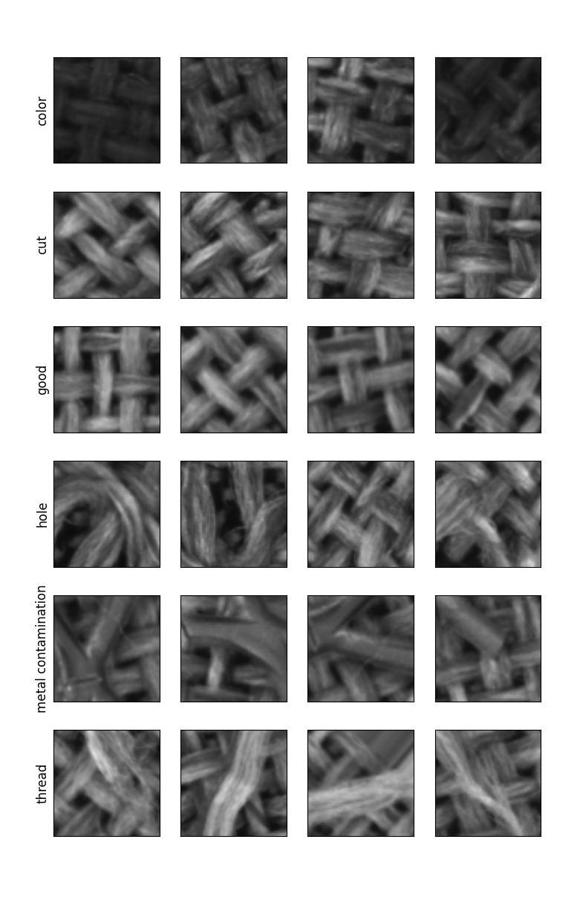

# Textile-Classification

ResNet example with textile data-set.

## Model

The model is contained in the `model.json` folder. It can be loaded into PerceptiLabs 10.x and trained once the data inputs are set up correctly.

---

The model is based on the skip connection pattern from ResNet. Like other vision backbones (VGG, ResNet, EfficientNet), it is designed for image classification. The output of the model is a probability distribution over 6 distinct classes.

## Dataset

The dataset is hosted on Google Drive and can be downloaded [here (1.2 GB)](https://drive.google.com/drive/folders/1i-k71RMxa0LjNJqAjh-cclN6RA-WeBmv?usp=sharing)

* `X.npy` is a NumPy array of shape [72000, 64, 64, 1], corresponding to 72,000 distinct 64x64 monochrome images.

* `Y.npy` is a NumPy array of shape [72000], which consists of the corresponding integer labels for each defect type.

---

The dataset is derived from the [Textile Defect Detection dataset](https://www.kaggle.com/belkhirnacim/textiledefectdetection/version/2) on Kaggle. We preprocessed the data into two NumPy arrays which can be immediately used for training in PerceptiLabs via data components.

The **Textile Defect Detection** dataset has images of textiles with their corresponding labels based of different kinds of defects that may take place in an industry setting. A randomly selected set of images from each class looks like the following:

